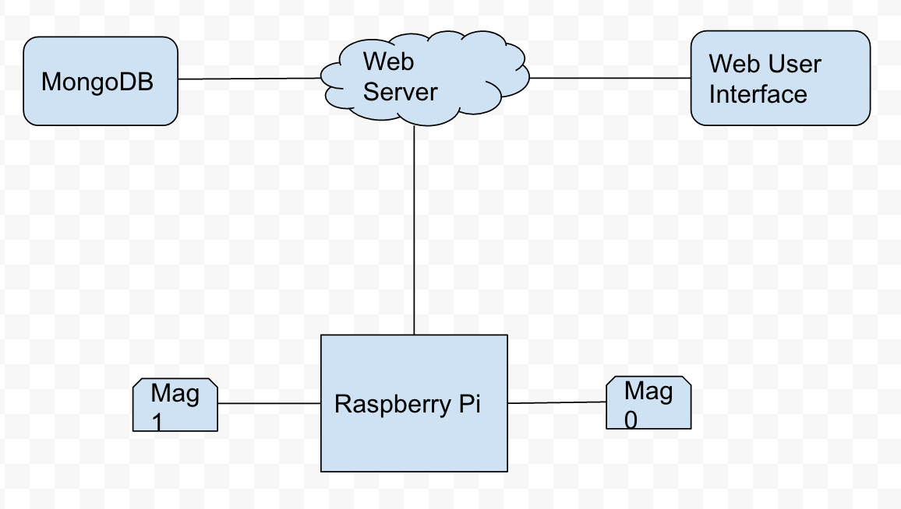

# EE 475 Capstone

By Eeshan Londhe, Nakul Malhotra, Henry Zhao, Sorav Sharma

- Relevant files:
  - server/app.js : contains the server code written in javascript using nodejs
  - server/mapinterface.html : contains web user interface
  - mag.py : python code running on raspberry pi to detect a car
  - config.json : configuration file for startup use

The high level block diagram is shown below:

